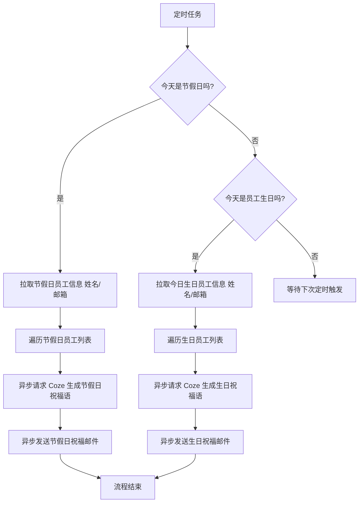

```mermaid
graph TD
    A[定时任务] --> B{今天是节假日吗?};
    B -- 是 --> C[拉取节假日员工信息 姓名/邮箱];
    B -- 否 --> D{今天是员工生日吗?};
    D -- 是 --> E[拉取今日生日员工信息 姓名/邮箱];
    D -- 否 --> F[等待下次定时触发];

    C --> G[遍历节假日员工列表];
    G --> H[异步请求 Coze 生成节假日祝福语];
    H --> I[异步发送节假日祝福邮件];

    E --> J[遍历生日员工列表];
    J --> K[异步请求 Coze 生成生日祝福语];
    K --> L[异步发送生日祝福邮件];

    I --> M[流程结束];
    L --> M;
```